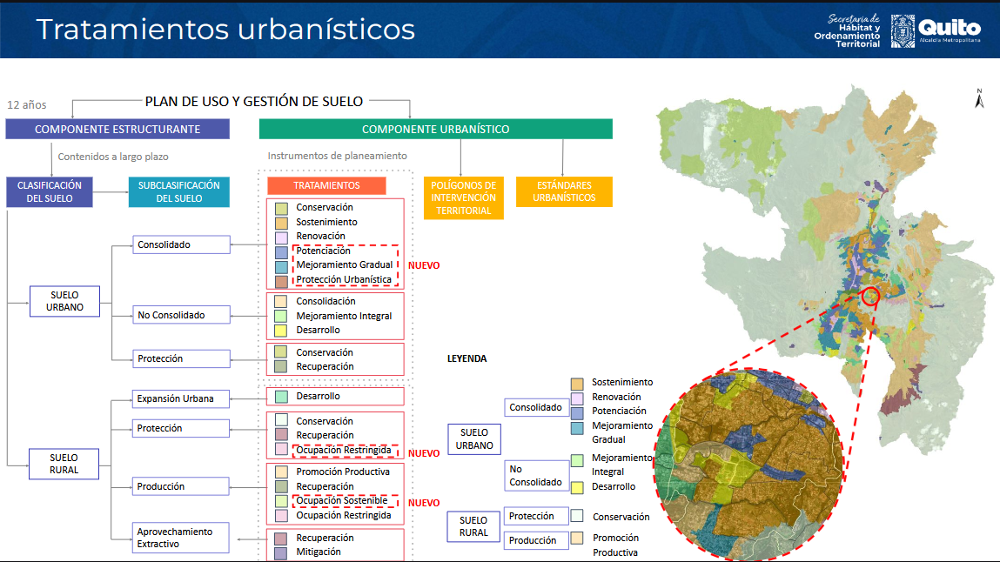

# Proyecto: Monitoreo del uso del suelo en la parroquia de San Antonio de Pichincha del Distrito Metropolitano de Quito.
Link code: https://colab.research.google.com/drive/1Fy6JawG_sK987rU5vMYMQbKHO2xXCi9r?usp=drive_link
---
## Preguntas orientadoras
*   ¿Cuales son las caracteristicas del uso del suelo?
*   ¿Cual es la densidad de lotes del suelo?
*   Con la disponibilidad de la data ¿Existe suelo vacante?
## Objetivos del Proyecto
### Objetivos general
*   Monitorear el uso del suelo en la parroquia de San Antonio de Pichincha del Distrito Metropolitano de Quito mediante el uso de tecnicas de ciencias de datos.
### Objetivos especifico
*   Identificar las librerias de python a usar para emplear datos espaciales.
*   Leer la informacion geoespacial mediante codigo de python.
*   Aplicar el tratamiento a la informacion geospacial mediante codigo de python.
*   Realizar un análisis exploratorio de datos espaciales mediante el uso de librerias de python.
*   Responder a la preguntas orientadoras para describir el estado del uso del suelo en la parroquia de San Antonio de Pichincha del Distrito Metropolitano de Quito.

---

### Fundamentos de ciencia de datos
Modulo 2 Proyecto
|   |   |
| :--- | :--- |
| **Autor:** | Ing. Diego F. Reyes Y. |
| **Fecha:** | octubre 2026 |
| **Fuente de Datos:** | Capa de Plan de Uso y Gestion del Suelo de la Secretaria de Hábitat y Ordenamiento Territorial https://gobiernoabierto.quito.gob.ec/   Capa de Lotes - Catastro de la Secretaria General de Planificación https://geoportal.quito.gob.ec/geoportal/descargas.php    Capa de Límite de Parroquias Rurales de la Secretaria General de Planificación https://geoportal.quito.gob.ec/geoportal/descargas.php|
---

# 1. Defincion del dominio del problema
Se esta realizando un estuido sobre el uso y aprovechamiento del suelo, la capacidad de fraccionamiento y la densidad de lotes en la  en la parroquia de San Antonio de Pichincha del Distrito Metropolitano de Quito
---

# 2. Adquisición y limpieza de datos

La adquisición de los datos parte de las fuentes oficiales, conforme a  la politica de datos abiertos.
Estos datos son:
*   catastro.gdb.zip
*   parroquia.gdb.zip
*   PUGS_2024.gdb.zip

 **Proceder a cargar la data al espacio de trabajo**
---
Instalación de librerias !pip install geopandas fiona shapely pyproj
---
Verificación de lectura de archivos
---
Revisión del sistema de referencia
---
Homogenización del sistema de referencia 
---
Visualización preliminar
Capa de ba003_uso_suelo_edificabilidad_a
Capa de LOTE
---
Identificación de área de estudio

Imprimir una muestra de 3 registros de la capa organizacion_territorial_parroquial_rural_a , para identificar campo que almacena la información del nombre de la parroquia
---
Identificar la lista de parroquias

Imprimir una lista con las categorías presentes en dpa_despar
---
Reparación de geometrías
---
Visualización de la capa LOTE y la capa ba003_uso_suelo_edificabilidad_a 
---
Inspección de la estructura de las capas
---
Exploración visual de capas
---
**Contexto para el filtrado de las capas a usar**

El **Plan de Uso y Gestión del Suelo** es un instrumento de planificación, ordenación y gestión del suelo que instrumentaliza políticas que permitan viabilizar los
planteamientos definidos en el PMDOT; que regula el uso y la edificabilidad del suelo urbano y rural; fue aprobado Ordenanza Metropolitana 044-2022 11 de noviembre 2022

*   Componente estructurante que clasifica el suelo en urbano y rural y su subcalsificacion, duracion de 12 años
*   Componente urbanistico define instrumentos de planeamiento del suelo tales como: Polígonos de Intervención Territorial, Tratamientos urbanísticos, Usos de suelo, Edificabilidad y Estándares urbanísticos.
*   Aplicación de planes complementarios que permite detallar, completar y desarrollar de forma específica las determinaciones
*   Gestión del suelo a partir de instrumentos  de gestión y financiamiento urbano

Acorde a la descrpcion del contenido de las capas se identifica que las **capas a usar** para analizar el monitoreo del uso del suelo en la parroquia de San Antonio de Pichincha del Distrito Metropolitano de Quito son:

*   ba003_uso_suelo_edificabilidad_a
*   ba004_prevision_suelo_vivienda_interes_social_a
*   bd001_plan_urbanistico_complementario_a
*   bi001_declaratoria_regularizacion_prioritaria_a
*   LOTE
*   BLOQUE_CONSTRUCTIVO
*   UNIDAD_CONSTRUCTIVA
*   MANZANA
*   AIVAS
*   organizacion_territorial_parroquial_rural_a
---
Chequeo de datos nulos, no data, valores negativos
Filtrado de campos
---
#3. Analisis exploratorio de los datos + Visualizacion de datos
---
*   ba003_uso_suelo_edificabilidad_a
*   ba004_prevision_suelo_vivienda_interes_social_a
*   bd001_plan_urbanistico_complementario_a
*   bi001_declaratoria_regularizacion_prioritaria_a
*   LOTE
*   BLOQUE_CONSTRUCTIVO
*   UNIDAD_CONSTRUCTIVA
*   MANZANA
*   AIVAS

###  DICCIONARIO DE METADATOS DE PLANIFICACIÓN (SAN ANTONIO DE PICHINCHA)

###  1. ba003_uso_suelo_edificabilidad_a (Zonificación PUGS)

| Variable | Atributo Clave | Impacto Territorial / Planificación |
| :--- | :--- | :--- |
| **clasifica** | Urbano / Rural | Delimita la frontera legal para el desarrollo de infraestructura de ciudad. |
| **subclasif** | Consolidado / Protección | Define las áreas aptas para edificación y zonas de conservación ecológica. |
| **uso_prin** | Residencial / Industrial | Establece las actividades humanas permitidas para evitar conflictos de suelo. |
| **pisos_ba** | Número Máximo de Pisos | Controla la densidad vertical y el perfil paisajístico de la parroquia. |
| **superf_ha** | Hectáreas Reales | Determina la extensión espacial de la norma de edificabilidad post-recorte. |

---

###  2. ba004_prevision_suelo_vivienda_interes_social_a (Suelo VIS)

| Variable | Atributo Clave | Impacto Territorial / Planificación |
| :--- | :--- | :--- |
| **descripcio** | Proyecto / Declaratoria | Identifica los programas gubernamentales activos de vivienda social. |
| **apto_vis** | Alta / Baja Aptitud | Califica la viabilidad técnica del terreno para albergar vivienda prioritaria. |
| **superf_ha** | Hectáreas Reales | Mide la reserva de suelo público o privado disponible para interés social. |

---

###  3. bd001_plan_urbanistico_complementario_a (Planes Especiales)

| Variable | Atributo Clave | Impacto Territorial / Planificación |
| :--- | :--- | :--- |
| **tipo_plan** | Plan Parcial / Maestro | Clasifica el instrumento legal que complementa las normas del PUGS. |
| **nam** | Nombre del Plan | Identifica proyectos específicos de renovación o desarrollo local. |
| **superf_ha** | Hectáreas Reales | Define el perímetro de actuación urbanística bajo régimen especial. |

---

###  4. bi001_declaratoria_regularizacion_prioritaria_a (Barrios a Regularizar)

| Variable | Atributo Clave | Impacto Territorial / Planificación |
| :--- | :--- | :--- |
| **predio** | ID de Expediente | Vincula el polígono de tierras con el proceso legal de legalización. |
| **nam** | Nombre del Asentamiento | Registra los barrios consolidados en la periferia que requieren intervención. |
| **superf_ha** | Hectáreas Reales | Mide el área urbana informal sujeta a reconocimiento oficial e infraestructura. |

---

###  5. LOTE (Catastro Predial)

| Variable | Atributo Clave | Impacto Territorial / Planificación |
| :--- | :--- | :--- |
| **NUMERO_LOTE** | Código Predial Corto | Identifica de forma única cada parcela dentro de la manzana catastral. |
| **FRENTE_TOTAL** | Metros Lineales | Evalúa si el lote cumple con el frente mínimo requerido para habilitar servicios. |
| **AREA_TERRENO_ESCRITURA** | m² Legales | Base de comparación contra el área geográfica real para detectar anomalías. |
| **PROPIEDAD** | Privada / Pública / Municipal | Define la naturaleza legal del dominio para gestión y expropiaciones. |
| **ZONIFICACION** | Código de Asignación | Conecta el lote catastral con su respectiva norma de construcción en el PUGS. |
| **superf_ha** | Hectáreas Reales | Área cartográfica actual del predio en San Antonio calculada post-recorte. |

---

###  6. BLOQUE_CONSTRUCTIVO (Huella de Edificación)

| Variable | Atributo Clave | Impacto Territorial / Planificación |
| :--- | :--- | :--- |
| **CAT_BLOQUE_ID** | Identificador de Estructura | Código maestro de vinculación espacial de la masa construida. |
| **PISOS** | Conteo de Niveles | Determina la altura física real construida para evaluar el cumplimiento normativo. |
| **superf_ha** | Hectáreas Reales | Registra el coeficiente de ocupación del suelo físico (área techada implantada). |

---

###  7. UNIDAD_CONSTRUCTIVA (Fichas de Construcción)

| Variable | Atributo Clave | Impacto Territorial / Planificación |
| :--- | :--- | :--- |
| **CAT_UC_ID** | ID de Unidad Inmobiliaria | Vincula subdivisiones internas (departamentos/locales) al dueño predial. |
| **PISOS** | Pisos Específicos | Detalla los niveles de consolidación interna de la edificación por bloque. |
| **superf_ha** | Hectáreas Reales | Mide el área constructiva detallada para el cálculo de avalúos y plusvalías. |

---

###  8. MANZANA (Estructura Urbana)

| Variable | Atributo Clave | Impacto Territorial / Planificación |
| :--- | :--- | :--- |
| **CODIGO_MANZANA** | Código Alfanumérico | Clave de indexación territorial intermedia usada por el municipio. |
| **NUMERO_PREDIOS** | Cantidad de Unidades | Mide la densidad inmobiliaria y niveles de propiedad horizontal en la manzana. |
| **NUMERO_LOTES** | Cantidad de Terrenos | Indica el grado de parcelación y fragmentación del espacio urbano consolidado. |
| **superf_ha** | Hectáreas Reales | Superficie total del bloque de manzanas para análisis de densidades prediales. |

---

###  9. AIVAS (Zonificación Valorativa del Suelo)

| Variable | Atributo Clave | Impacto Territorial / Planificación |
| :--- | :--- | :--- |
| **TIPO** | Residencial / Comercial / Rural | Define el sector económico de la zona homogénea de valoración catastral. |
| **RANGO_VALORATION** | Escala en USD/m² | Segmenta el territorio según el costo base del suelo para el impuesto predial. |
| **superf_ha** | Hectáreas Reales | Extensión geográfica de las franjas de valor tributario dentro de la parroquia. |

---

###  10. organizacion_territorial_parroquial_rural_a (Límite Político)

| Variable | Atributo Clave | Impacto Territorial / Planificación |
| :--- | :--- | :--- |
| **dpa_despar** | San Antonio | Establece el nombre oficial del polígono parroquial de control de datos. |
| **adm_zonal** | La Delicia | Identifica la entidad administrativa descentralizada que ejerce competencias. |
| **superf_ha** | Hectáreas Reales | Denominador maestro del territorio para el cálculo de tasas de ocupación total. |
